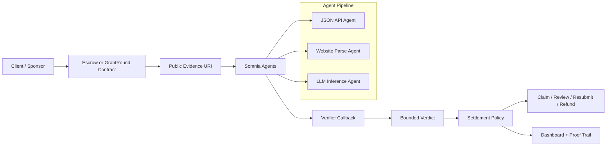

<h1 align="center">Vigilia Protocol</h1>

<p align="center">
  <strong>Agent-verified work settlement on Somnia.</strong>
</p>

<p align="center">
  Vigilia helps grant programs, clients, and AI-agent operators fund work, verify public evidence with Somnia Agents, and settle outcomes through programmable on-chain policy.
</p>

<p align="center">
  Built during the <a href="https://somnia.network/">Somnia</a> Agentathon for the challenge:
  <em>Build the most novel and high-impact agent-driven application on Somnia.</em>
</p>


<p align="center">
  <a href="https://vigilia-protocol.vercel.app/dashboard">
    
  </a>
  <a href="https://somnia.network/">
  
</a>
  <a href="#how-vigilia-works">
    
  </a>
  <a href="./docs/proofs/2026-06-08-final-demo-data.md">
    
  </a>
  <a href="./LICENSE">
    
  </a>
</p>

<p align="center">
  <a href="#live-demo">Live Demo</a> •
  <a href="#submission-snapshot">What Is Live</a> •
  <a href="#how-vigilia-works">How It Works</a> •
  <a href="#product-workflows">Workflows</a> •
  <a href="#deployed-somnia-testnet-stack">Testnet Proof</a> •
  <a href="#roadmap">Roadmap</a> •
  <a href="#documentation">Docs</a>
</p>

---

## TL;DR

Vigilia is a Somnia-native protocol for **agent-verified work settlement**.

```text
Fund work
  → submit public evidence
  → Somnia Agents verify
  → bounded verdict is recorded
  → contract enforces claim / review / resubmission / refund
```
>Project status: Somnia Agentathon / testnet MVP. Not audited or intended for production use.
Agent verdicts evaluate submitted public evidence and should not be treated as independent proof
or sufficient authorization for unattended production payouts.

The current MVP proves two live product surfaces:

| Product surface      | Primary use case                                     | Proven workflow                                                                                                             |
| -------------------- | ---------------------------------------------------- | --------------------------------------------------------------------------------------------------------------------------- |
| **Milestone Escrow** | Freelance work, technical milestones, AI-agent tasks | Client funds escrow → builder submits evidence → agents verify → contractor claims or resubmits                             |
| **GrantRound**       | Hackathons, grants, accelerators, ecosystem programs | Sponsor funds pool → builders submit applications → agents screen evidence → judges select finalists → winners claim prizes |

Vigilia does **not** ask AI to control funds. Agents screen public evidence and return bounded verdicts. Contracts enforce settlement rules. Humans remain in the loop where judgment is required.

> The agent verifies evidence. The contract enforces settlement.

---

## Live Demo

| Item                    | Link                                                                                                                                 |
| ----------------------- | ------------------------------------------------------------------------------------------------------------------------------------ |
| Hosted app              | https://vigilia-protocol.vercel.app/                                                                                                 |
| Dashboard               | https://vigilia-protocol.vercel.app/dashboard                                                                                        |
| Network                 | [Somnia Testnet](https://somnia.network/) / chain ID `50312`                                                                         |
| Somnia docs             | https://docs.somnia.network/                                                                                                         |
| Final proof doc         | [`docs/proofs/2026-06-08-final-demo-data.md`](./docs/proofs/2026-06-08-final-demo-data.md)                                           |
| Deployment record       | [`docs/DEPLOYMENTS.md`](./docs/DEPLOYMENTS.md)                                                                                       |
| Escrow evidence example | [`demo/evidence/escrow-real/evidence-real-verified-complete.json`](./demo/evidence/escrow-real/evidence-real-verified-complete.json) |
| Grant evidence example  | [`demo/evidence/grants-real/evidence-real-verified-complete.json`](./demo/evidence/grants-real/evidence-real-verified-complete.json) |

The dashboard is designed as a judge-friendly inspection surface for the final demo. It shows deployed contracts, live protocol metrics, evidence examples, bounded verdicts, and settlement history.


---

## Why This Matters

Funded technical work is still verified manually.

Grant teams, hackathon organizers, clients, and ecosystem programs often review submissions through a mix of repositories, spreadsheets, chats, demos, deployment links, and subjective follow-up.

That creates four problems:

* **slow review** — every submission requires manual inspection;
* **weak proof trail** — payout decisions often live in private chats or spreadsheets;
* **unclear accountability** — builders cannot easily reuse verified work history;
* **manual operations** — sponsors still need to coordinate approvals, payouts, refunds, and milestone status by hand.

Vigilia turns that into a public settlement workflow:

```text
Evidence URI
  → agent request
  → bounded verdict callback
  → contract state transition
  → claim / review / refund
  → public dashboard and proof trail
```

This is especially valuable for grant and accelerator programs where many builders submit public technical artifacts and sponsors need a faster, more transparent review process.

---

## Built For

**Initial wedge: grant, hackathon, and accelerator operations.**

| User                          | Workflow                                                | Outcome                                          |
| ----------------------------- | ------------------------------------------------------- | ------------------------------------------------ |
| **Grant programs**            | Screen submissions, select finalists, distribute prizes | Less manual review, clearer payout trail         |
| **Hackathons / accelerators** | Verify public builder evidence before approvals         | Faster judging support and stronger transparency |
| **Clients**                   | Fund milestone-based software work in escrow            | Evidence-based release, review, or resubmission  |
| **AI-agent operators**        | Let agents complete recurring public tasks              | On-chain receipts for agent work                 |
| **Builders**                  | Accumulate verified public work records                 | Portable proof of contribution                   |
| **Protocol ecosystems**       | Manage contributor programs and grant payouts           | Repeatable operations layer for ecosystem growth |

The first commercial path is **hackathon / grant operations SaaS**: programs fund rounds, agents screen public evidence, reviewers select finalists, and contracts enforce claims and refunds.

---

## Submission Snapshot

The final demo proves live Somnia testnet flows across milestone settlement and grant operations.

| Area                             | Status                                  |
| -------------------------------- | --------------------------------------- |
| Milestone Escrow                 | Live on Somnia testnet                  |
| GrantRound                       | Live on Somnia testnet                  |
| Two-agent escrow verification    | Proven end-to-end                       |
| Three-agent GrantRound screening | Proven end-to-end                       |
| Dashboard                        | Hosted and connected to final demo data |
| Public evidence examples         | Available in repo                       |
| Deployment records               | Available in docs                       |
| Final proof runbook              | Available in docs                       |
| Production audit                 | Not completed; hackathon/testnet MVP    |

Final demo metrics are documented in [`docs/proofs/2026-06-08-final-demo-data.md`](./docs/proofs/2026-06-08-final-demo-data.md).

Explorer views may lag on testnet. Direct RPC reads and proof docs should be treated as the source of truth for the final demo.

---

## What Is Live vs Roadmap

| Area                                          | Status                 |
| --------------------------------------------- | ---------------------- |
| Native-token milestone escrow                 | Live                   |
| Public evidence submission                    | Live                   |
| JSON API agent verification                   | Live                   |
| Website Parse screening                       | Live for GrantRound    |
| LLM bounded verdicts                          | Live                   |
| Contract-enforced claim/review/resubmit paths | Live                   |
| Grant finalist selection and prize claims     | Live                   |
| Dashboard proof trail                         | Live                   |
| Batch approvals for grant programs            | Roadmap                |
| Evidence manifest builder                     | Roadmap                |
| ERC20 / stablecoin escrow                     | Roadmap                |
| Builder reputation network                    | Roadmap                |
| AI-agent work marketplace                     | Roadmap                |
| Production audit and mainnet hardening        | Future production path |

---

## How Vigilia Works



### Trust boundaries

| Component                     | Role                   | Boundary                                   |
| ----------------------------- | ---------------------- | ------------------------------------------ |
| Public evidence               | Input for verification | Treated as untrusted                       |
| Somnia Agents                 | Evidence screening     | Cannot arbitrarily move funds              |
| Verifier contract             | Normalizes callbacks   | Records only bounded verdicts              |
| Escrow / GrantRound contracts | Settlement enforcement | Apply predefined policy                    |
| Sponsors / judges / clients   | Human judgment         | Select finalists or review ambiguous cases |
| Dashboard                     | Inspection layer       | Displays state and proof trail             |

---

## Product Workflows

### 1. Milestone Escrow

```text
Client creates task
  → client funds escrow
  → contractor submits public evidence URL
  → Somnia agents verify evidence
  → contract records Complete / NeedsReview / Incomplete / VerificationFailed
  → contractor claims, resubmits, or enters review path
```

Use cases:

* freelance technical milestones;
* public GitHub deliverables;
* deployed contract verification;
* AI-agent task settlement;
* recurring proof-of-work tasks.

---

### 2. GrantRound

```text
Sponsor creates grant round
  → sponsor funds prize pool
  → builders submit applications and evidence
  → agents screen submissions
  → judges or sponsors select finalists
  → selected finalists claim prizes on-chain
  → unallocated funds can be refunded
```

Use cases:

* hackathon finalist selection;
* grant program operations;
* accelerator milestone payouts;
* ecosystem contributor rewards;
* batch approvals for future grant workflows.

Agents reduce review load. Judges and sponsors remain responsible for finalist selection. Contracts enforce winner caps, reserved payouts, claims, and refunds.

---

## Architecture

Vigilia has four layers.

### 1. On-chain settlement layer

* `VigiliaEscrow`
* `VigiliaGrantRound`
* settlement states
* funding and claims
* review and resubmission policy
* prize pool accounting
* winner caps and refunds

### 2. Agent verification layer

* JSON API evidence fetch
* Website Parse evidence extraction
* LLM bounded verdict generation
* verified callback handling
* normalized verdict recording

### 3. Evidence layer

* public evidence URLs
* JSON evidence manifests
* web-readable project evidence
* demo fixtures and real proof records

### 4. Product interface layer

* dashboard
* final proof views
* deployment records
* runbooks
* judge-friendly demo path

Full architecture:

* [`docs/04_SYSTEM_ARCHITECTURE.md`](./docs/04_SYSTEM_ARCHITECTURE.md)
* [`docs/06_AGENT_AND_DATA_FLOWS.md`](./docs/06_AGENT_AND_DATA_FLOWS.md)

---

## Deployed Somnia Testnet Stack

| Contract         | Address                                                                                                                                    | Workflow                                 |    Deposit | Record                                                                            |
| ---------------- | ------------------------------------------------------------------------------------------------------------------------------------------ | ---------------------------------------- | ---------: | --------------------------------------------------------------------------------- |
| Milestone Escrow | [`0x1FA22E3a97dabB9a8C6de3a5B59eF6cCD5B2F4b9`](https://shannon-explorer.somnia.network/address/0x1FA22E3a97dabB9a8C6de3a5B59eF6cCD5B2F4b9) | TwoAgent settlement                      | `0.36 STT` | [`v0.2.3`](./deployments/somnia-testnet-50312-two-agent-settlement-hardened.json) |
| Escrow verifier  | [`0xdE0aC9700E591b54A418665575f2e1d329D78f3D`](https://shannon-explorer.somnia.network/address/0xdE0aC9700E591b54A418665575f2e1d329D78f3D) | JSON facts + LLM verdict                 | `0.36 STT` | [`v0.2.3`](./deployments/somnia-testnet-50312-two-agent-settlement-hardened.json) |
| GrantRound       | [`0x5aE1918Dcaa0A00a1d647e1c9946F7FF3fB61679`](https://shannon-explorer.somnia.network/address/0x5aE1918Dcaa0A00a1d647e1c9946F7FF3fB61679) | ThreeAgent screening                     | `0.81 STT` | [`v0.4.0`](./deployments/somnia-testnet-50312-grant-round-three-agent.json)       |
| Grant verifier   | [`0xb0a1cdf062B4c295fC2A00F4bf1C84062F40d8e4`](https://shannon-explorer.somnia.network/address/0xb0a1cdf062B4c295fC2A00F4bf1C84062F40d8e4) | JSON facts + Website Parse + LLM verdict | `0.81 STT` | [`v0.4.0`](./deployments/somnia-testnet-50312-grant-round-three-agent.json)       |

See [`docs/DEPLOYMENTS.md`](./docs/DEPLOYMENTS.md) for deployment notes, proof links, explorer caveats, and historical artifacts.

---

## Quick Start

### Requirements

* Foundry
* Node.js
* npm
* Somnia testnet RPC configuration in `.env`

### Build and test

```bash
forge build
forge test
npm --prefix app/web run test
npm --prefix app/web run build
```

Optional evidence tooling:

```bash
npm --prefix app/evidence-tool run build
```

Use [`.env.example`](./.env.example) for required non-secret configuration names. Do not commit private keys or live RPC secrets.

---

## Demo Commands

Inspect the live GrantRound deployment:

```bash
make grant-demo-inspect
```

Inspect the final fixed-work escrow task when `.env` is configured:

```bash
make final-demo-escrow-inspect-task
```

Build web-validated public evidence:

```bash
make build-web-validated-evidence
```

List available commands:

```bash
make help
```

---

## Dashboard

The hosted dashboard provides a judge-friendly view of the final demo:

* protocol metrics;
* deployed contracts;
* milestone and grant activity;
* evidence examples;
* agent verdicts;
* settlement status;
* proof links.

Dashboard:

https://vigilia-protocol.vercel.app/dashboard

The dashboard is a demo and inspection interface. It is not a production admin panel.

---

## Documentation

Start here:

| Document                                                                                   | Purpose                               |
| ------------------------------------------------------------------------------------------ | ------------------------------------- |
| [`docs/README.md`](./docs/README.md)                                                       | Documentation map                     |
| [`docs/DEPLOYMENTS.md`](./docs/DEPLOYMENTS.md)                                             | Active deployments and proof links    |
| [`docs/proofs/2026-06-08-final-demo-data.md`](./docs/proofs/2026-06-08-final-demo-data.md) | Final demo proof data                 |
| [`docs/01_PRODUCT_THESIS.md`](./docs/01_PRODUCT_THESIS.md)                                 | Product thesis and positioning        |
| [`docs/02_MARKETS_AND_USE_CASES.md`](./docs/02_MARKETS_AND_USE_CASES.md)                   | Markets, users, startup paths         |
| [`docs/03_WHY_SOMNIA.md`](./docs/03_WHY_SOMNIA.md)                                         | Why Somnia is the right environment   |
| [`docs/04_SYSTEM_ARCHITECTURE.md`](./docs/04_SYSTEM_ARCHITECTURE.md)                       | System architecture                   |
| [`docs/06_AGENT_AND_DATA_FLOWS.md`](./docs/06_AGENT_AND_DATA_FLOWS.md)                     | Agent and data flows                  |
| [`docs/07_MVP_ROADMAP_AND_RISKS.md`](./docs/07_MVP_ROADMAP_AND_RISKS.md)                   | Roadmap, risks, and MVP boundaries    |
| [`docs/10_DEPLOYMENT_AND_DEMO_RUNBOOK.md`](./docs/10_DEPLOYMENT_AND_DEMO_RUNBOOK.md)       | Deployment and demo runbook           |
| [`docs/12_MULTI_AGENT_SETTLEMENT_RUNBOOK.md`](./docs/12_MULTI_AGENT_SETTLEMENT_RUNBOOK.md) | Multi-agent settlement runbook        |
| [`docs/15_GRANT_ROUND_RUNBOOK.md`](./docs/15_GRANT_ROUND_RUNBOOK.md)                       | GrantRound flow and finalist workflow |

Planning drafts and outdated design notes should stay unlinked from the root README or move to `docs/archive/`.

---

## Repository Map

```text
vigilia-protocol/
├─ src/                  # Solidity contracts
├─ script/               # Foundry deployment and demo scripts
├─ test/                 # Foundry tests
├─ app/
│  ├─ web/               # Dashboard / frontend
│  └─ evidence-tool/     # Evidence helper tooling
├─ demo/
│  └─ evidence/          # Demo evidence fixtures and real proof examples
├─ deployments/          # Somnia testnet deployment records
├─ docs/                 # Product, architecture, runbooks, proof docs
├─ Makefile              # Reviewer and demo commands
├─ foundry.toml
└─ README.md
```

---

## Roadmap

Vigilia starts with grant operations because the workflow is urgent, repeatable, and naturally evidence-based.

| Phase                      | Focus                                                                             | Product value                                                              |
| -------------------------- | --------------------------------------------------------------------------------- | -------------------------------------------------------------------------- |
| **Live MVP**               | Milestone Escrow, GrantRound, Somnia Agent verification, dashboard proof trail    | Proves agent-verified settlement works end-to-end                          |
| **Grant operations wedge** | Batch approvals, grant templates, sponsor dashboard, evidence manifest builder    | Turns Vigilia into useful tooling for hackathons, grants, and accelerators |
| **Settlement expansion**   | ERC20/stablecoin escrow, review/dispute workbench, reusable verification policies | Makes the protocol usable for broader technical work settlement            |
| **Network layer**          | Builder reputation records, recurring task settlement, AI-agent work marketplace  | Turns verified work history into portable protocol infrastructure          |
| **Ecosystem tooling**      | Protocol contributor programs, ecosystem dashboards, grant analytics              | Gives chains and ecosystems a repeatable operations layer                  |

Near-term priorities:

* batch finalist approvals and prize operations;
* grant and accelerator templates;
* sponsor/reviewer dashboard;
* hosted evidence manifest builder;
* stronger deployment and proof indexing;
* ERC20 / stablecoin escrow support;
* review and dispute workbench.

---

## Product Boundaries

Vigilia is intentionally not:

* a production-audited escrow protocol;
* a custody provider;
* a generic AI automation platform;
* a replacement for human judges or sponsors;
* a system where AI can arbitrarily move funds;
* a full freelance marketplace in the MVP;
* a KYC, fiat, or legal-contract platform.

The MVP proves a narrower and stronger primitive:

> Public evidence can be screened by Somnia Agents, normalized into bounded verdicts, and connected to contract-enforced settlement policy.

---

## Final Takeaway

**Vigilia turns funded work into a verifiable settlement workflow.**

Grant teams, sponsors, clients, and agent operators should not have to coordinate technical review, approvals, claims, and payout proof through private chats and spreadsheets.

Vigilia gives them a Somnia-native workflow:

```text
funded work
  → public evidence
  → agent verification
  → bounded verdict
  → contract-enforced settlement
  → reusable proof trail
```

The result is not an autonomous AI judge. It is settlement infrastructure for real work: agent-screened, human-reviewable, contract-enforced, and publicly verifiable.

---

## License

MIT — see [`LICENSE`](./LICENSE)
