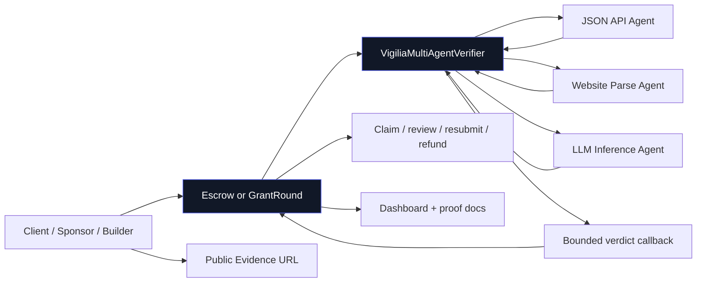
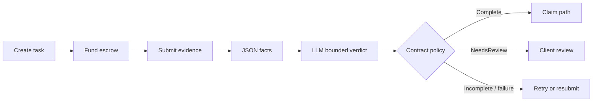
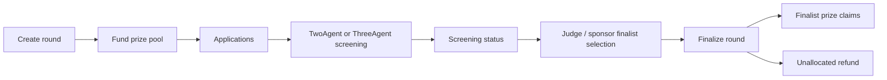
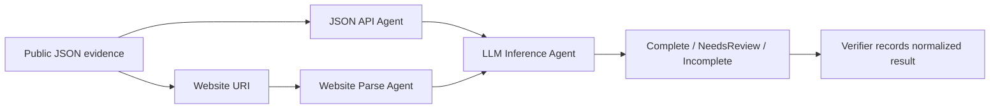

# System Architecture

## Final Submission Status

This document contains both the original target architecture and the current hackathon implementation. The live Somnia testnet MVP is intentionally narrower:

- `VigiliaEscrow` handles fixed-work milestone settlement.
- `VigiliaGrantRound` handles grant/bounty/hackathon rounds.
- `VigiliaMultiAgentVerifier` coordinates Somnia Agent requests and bounded callbacks.
- The dashboard reads deployed contract state and events.
- Data Streams/reputation records remain an ecosystem path, not a fund-safety dependency.

The live architecture keeps the most important trust boundary: agents screen evidence and record bounded verdict metadata; contracts enforce payout, claim, refund, and winner-cap rules.

## Current Live System



### Milestone Escrow Flow



### GrantRound Flow



### Agent Pipeline



Trust boundaries:

1. Public evidence is untrusted input.
2. Agents are bounded screeners.
3. The verifier records normalized results and rejects unknown verdicts.
4. Contracts enforce state machines and accounting.
5. Human review remains available for ambiguous cases.

## High-Level Architecture

```text
Client / Program / Agent Operator
        │
        ▼
Project + Task Creation
        │
        ▼
Escrow Funding
        │
        ▼
Builder / AI Agent submits public evidence
        │
        ▼
SubmissionRegistry emits WorkSubmitted
        │
        ├──────────────► Reactivity listener updates UI / triggers verification
        │
        ▼
AgentVerifier creates Somnia Agent requests
        │
        ├── JSON API Agent checks structured public data
        ├── Website Parse Agent extracts facts from docs/demo/README
        └── LLM Inference Agent classifies milestone completion
        │
        ▼
Agent callbacks return bounded verdicts
        │
        ▼
VerificationPolicy transitions task state
        │
        ├── COMPLETE → claim/release path
        ├── NEEDS_REVIEW → human review path
        └── INCOMPLETE → resubmission path
        │
        ▼
Escrow settlement / dispute / refund logic
        │
        ▼
Data Streams publish proof-of-work records
        │
        ▼
Dashboard / Builder profile / Program reporting
```

## Core Modules

### 1. Project Registry

Responsible for project/program creation and metadata.

A project can represent:

- a grant program,
- a freelance contract,
- a client/contractor agreement,
- an AI-agent task group,
- an accelerator milestone track.

### 2. Task / Milestone Registry

Responsible for task definitions and milestone requirements.

Stores:

- task ID,
- project ID,
- client/operator,
- contractor/builder/agent,
- reward token,
- reward amount,
- metadata URI,
- required evidence fields,
- deadline,
- review window,
- state.

### 3. Escrow

Responsible for holding funds and releasing/refunding according to verified policy.

Escrow must not trust arbitrary AI output. Settlement must be gated through deterministic policy and explicit states.

### 4. Submission Registry

Responsible for work submissions.

Stores:

- submission ID,
- task ID,
- submitter,
- repo URL,
- docs URL,
- demo URL,
- deployment address,
- evidence URI,
- evidence hash,
- status.

### 5. Agent Verifier

Responsible for invoking Somnia Agents and handling callbacks.

Tracks:

- request ID,
- submission ID,
- agent type,
- callback status,
- decoded result,
- final verification result.

### 6. Verification Policy

Responsible for converting agent results into allowed task-state transitions.

Examples:

```text
Agent COMPLETE + client approves → claim enabled
Agent COMPLETE + review window expired → claim enabled
Agent COMPLETE + client challenges → dispute/review
Agent NEEDS_REVIEW → manual review required
Agent INCOMPLETE → resubmission required
Agent failure/timeout → retry or manual review
```

### 7. Dispute / Review Module

Responsible for human review and dispute resolution.

MVP can use a trusted program operator or admin resolver. Future versions can use arbitrators, multi-reviewers, staking, or DAO mechanisms.

### 8. Reputation Registry

Responsible for recording durable builder/agent work history.

MVP can be event-first and Data-Streams-first, with minimal on-chain storage.

Future versions can add:

- badges,
- builder profiles,
- agent profiles,
- skill tags,
- verified milestone counts,
- reputation-weighted review roles.

### 9. Data Streams Publisher

Responsible for publishing typed records:

- task created,
- work submitted,
- agent verification,
- task settled,
- dispute raised/resolved,
- reputation updated.

### 10. Dashboard

Responsible for product UX:

- create task,
- fund escrow,
- submit work,
- start verification,
- view agent verdict,
- approve/challenge,
- claim payout,
- see Data Stream proof records.

## Minimal MVP Architecture

The first hackathon version can be smaller:

```text
VigiliaProjectRegistry
VigiliaEscrow
VigiliaSubmissionRegistry
VigiliaAgentVerifier
VigiliaPolicy
Data Stream publisher script/service
Simple dashboard
```

## MVP vs Future Responsibilities

| Responsibility | MVP | Future |
|---|---|---|
| Fixed task escrow | Yes | Yes |
| Milestone escrow | Yes, simple | Advanced multi-milestone projects |
| Hourly contracts | No | Optional later |
| Retainers | No | Optional later |
| Agent verification | Yes | Multi-agent verification pipelines |
| Client approval | Yes | Delegated review teams |
| Disputes | Simple operator resolution | Arbitrator network / review marketplace |
| Data Streams | Yes | Rich public reputation graph |
| Reactivity | Yes if stable | Deeper event-driven automation |
| Price feeds | Optional | Budget analytics, USD fee display |
| Marketplace discovery | No | Later |
| KYC / fiat payouts | No | Later, if commercially necessary |

## Trust Model

Vigilia should clearly separate:

1. **Evidence collection** — public data fetched or parsed by agents.
2. **Interpretation** — LLM classifies evidence into bounded verdicts.
3. **Policy** — deterministic contract rules decide what state transition is allowed.
4. **Settlement** — escrow transfers funds only through approved states.
5. **Review / dispute** — human override handles ambiguous cases.

The LLM should never directly choose arbitrary payout addresses, amounts, or contract calls.

## Safety Pattern

Good pattern:

```text
LLM returns: COMPLETE / NEEDS_REVIEW / INCOMPLETE
Policy checks: task funded, submitter authorized, review window, no dispute, confidence threshold
Escrow action: enable claim or require review
```

Bad pattern:

```text
LLM returns arbitrary instruction
Escrow executes it directly
```

## Public Evidence First

Vigilia MVP should verify public technical evidence only:

- GitHub repo,
- README,
- docs,
- demo URL,
- deployment address,
- explorer link,
- test logs,
- package release,
- closed issue / merged PR.

Avoid private client evidence in MVP because it introduces access control, privacy, and legal complexity.
